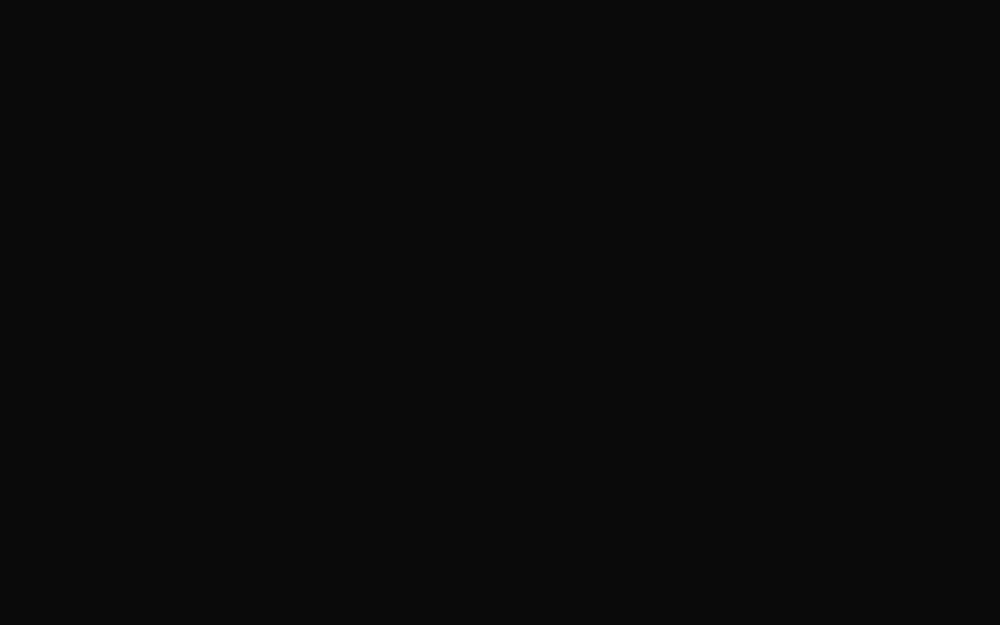
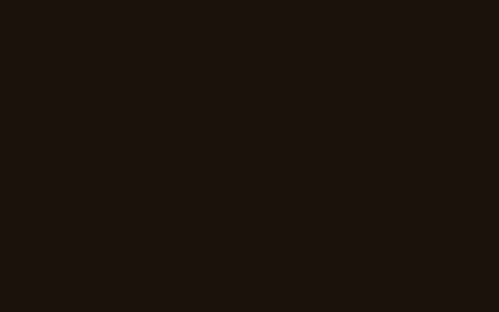
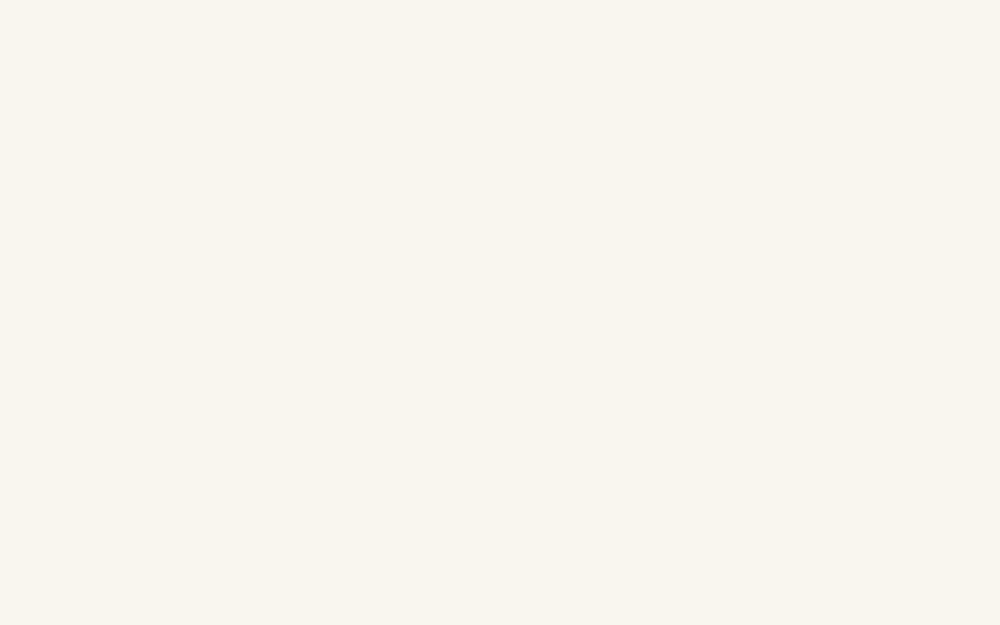
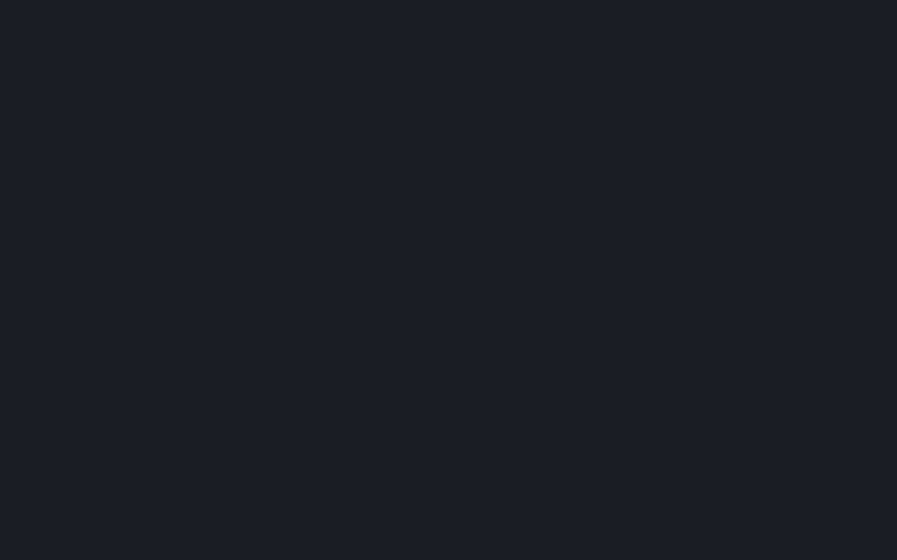

# Theme screenshots / لقطات السمات

Generated by `apps/web/e2e/screenshot-themes.spec.ts`. Six screenshots cover the
three Ruhool themes in both light and dark variants at 1440x900 viewport.

## Gallery

### claude-clean

| Light | Dark |
| --- | --- |
|  |  |

Neutral, Claude-inspired palette. / لوحة ألوان محايدة مستوحاة من كلود.

### desert-caravan

| Light | Dark |
| --- | --- |
|  |  |

Warm desert tones, Ruhool signature theme. / ألوان صحراوية دافئة، السمة المميزة لرحول.

### academic

| Light | Dark |
| --- | --- |
|  |  |

Scholarly serif-leaning palette for research contexts. / لوحة أكاديمية للسياقات البحثية.

## Regenerate

```bash
# 1. start the web dev server (port 3000)
pnpm --filter @ruhool/web dev

# 2. in another shell, run the spec
pnpm --filter @ruhool/web exec playwright test e2e/screenshot-themes.spec.ts --reporter=list
```

PNGs are written to this directory. Each theme/variant combo is selected via
`localStorage` preload (`ruhool-theme`, `ruhool-variant`) so the boot script
applies the correct attributes before first paint.
